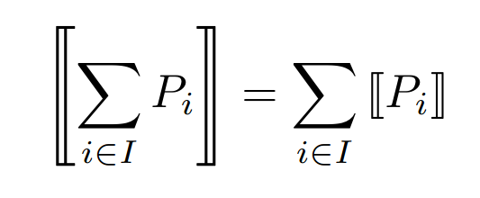

# VP-CCS Compiler
Compiler which transpiles code written in the _Value Passing_ version of the [Calculus of Communicating Systems](https://link.springer.com/book/10.1007/3-540-10235-3) to the standard one introduced by Milner in 1980.

The following grammar defines the standard syntax used in CCS:

```
P :=        # process
  | 0       # inactive process
  | a.P     # prefix: input in channel a followed by P
  | 'a.P    # prefix: output from channel a followed by P
  | P + Q   # non-deterministic choice between processes P and Q
  | P | Q   # parallel execution of processes P and Q
  | P \ L   # restriction of channels in L to process P
  | P[f]    # relabeling: map channels in P according to function f
  | A       # process constant, starting with a capital letter
```

This language can be extended to include values for better development experience:

```
P :=                     # process
  | 0                    # inactive process
  | a(x).P               # prefix: receive a value into variable x through channel a, followed by P
  | 'a(v).P              # prefix: output value v from channel a, followed by P
  | if b then P else Q   # conditional branching
  | P + Q                # non-deterministic choice between processes P and Q
  | P | Q                # parallel execution of processes P and Q
  | P \ L                # restriction of channels in L to process P
  | P[f]                 # relabeling: map channels in P according to function f
  | A(v_1, ..., v_n)     # process constant with arguments of variable arity, starting with a capital letter

E :=                     # expressions
  | a                    # arithmetic expressions
  | b                    # Boolean expressions

a :=                     # arithmetic expressions
  | k                    # constant
  | x                    # variable, can be any lowercase-starting name
  | a + a                # sum
  | a - a                # subtraction
  | a * a                # multiplication

b :=                     # Boolean expressions
  | e = e                # equality
  | e ≤ e                # less than or equal to
  | e < e                # less than
  | e ≥ e                # greater than or equal to
  | e > e                # greater than
  | !e                   # negation
  | e ∧ e                # logical AND
  | e V e                # logical OR
```

## Building From Source
Make sure to have Cabal installed, usually through [GHCup](https://www.haskell.org/ghcup/).
The code is compatible with Haskell Compiler GHC 9.10.1 and it can be compiled simply running:

```bash
cabal update
cabal install
```

Cabal will then place the executable in ```CABAL_DIR/bin```. On Linux this is usually ```~/.cabal/bin```.

## Usage
The compiler will then work as a CLI tool with the following usage:

```
Usage: vpccs-exec [-m|--max MAX] PATH
```

```-m``` specifies the biggest integer the compiler can utilize while concretizing the variables. If left unspecified, it will default to 5. A too large number could cause an Out-Of-Memory error.
```PATH``` is a positional argument representing the path to the source file to compile. A ```.vccs``` file extension is expected. The output will be placed in the same directory with the same name but extension ```.ccs```.

Some example programs are provided within the ```programs``` directory.

## Encoding
Both standard CCS and the value-passing extension exhibit the same expressiveness since standard CCS can encode values. This is the pseudo-code of the encoding function:

### Definitions
Set of actions:

Set of process constants:


### Action Prefixing
Input action on channel a:

Output action on channel a:

Internal synchronization:


### Process Algebra
Non-deterministic choice:

Parallel execution:

Channel restriction:

Relabeling:


### Conditions
If then else:


### Process Constants
Encoding of input expressions for process constants:


